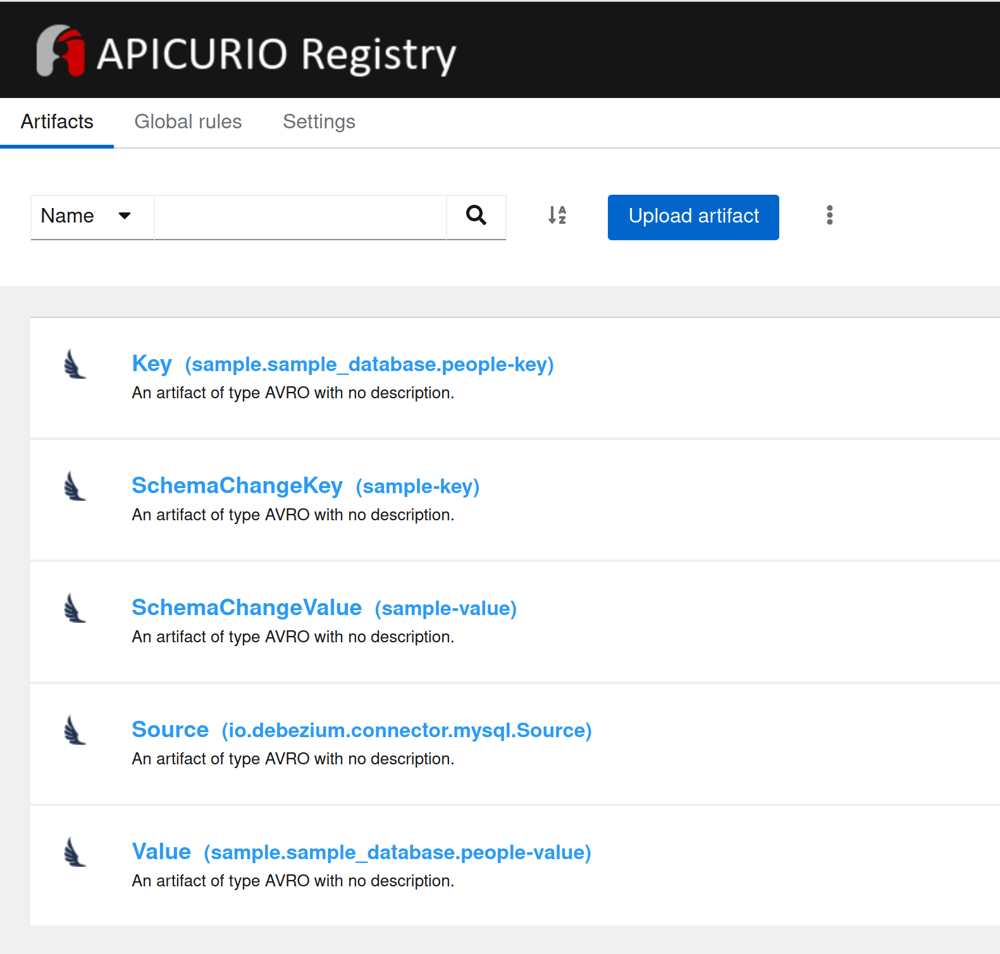

# RDS, Debezium and a MSK Kafka cluster using Terraform

Creates an entire environment within its own VPC on AWS to stream data from a MariaDB RDS instance to Kafka using Debezium with Avro serialization. Apicurio provides a schema registry for the data.

* Creates a MariaDB RDS instance
* Uses AWS Secrets Manager to store RDS access details
* Generates some sample data in the Mariadb database
* Creates a Kafka cluster using AWS MSK
* Creates an EC2 instance with Debezium to replicate a table in the RDS instance to Kafka
* Installs the Apicurio schema registry for Apache Avro serialization

## Table of Contents

- [Prepare an AMI using Packer](#prepare-an-ami-using-packer)
- [Deploy the infrastructure](#deploy-the-infrastructure-using-terraform)
- [Debezium](#debezium)
- [Schema registry](#schema-registry)
- [Security](#security)
- [Infrastructure cost](#estimated-cost)

 ## Prepare an AMI using Packer

You will need to create the Debezium AMI first, using Packer.

Update `packer/variables.json to include your AWS credentials profile name, preferred region and instance size. Then run the following commands to Validate the file and Build an AMI that Terraform can use:

Validate:
> packer validate --var-file=variables.json debezium_instance.json

Build:
> packer build --var-file=variables.json debezium_instance.json

Takes around 6 minutes.

 ## Deploy the infrastructure using Terraform

Once your AMI has been created, you can run Terraform to create the necessary infrastructure.

First, create a terraform.tfvars file with the following values that are used to find your AMI and allow SSH acccess:

```
my_ip_address  = "123.123.123.123"
aws_account_id = "01234567890"
```

Run Terraform:

```
terraform init
terraform apply
```

## Debezium

Debezium and the connector to the database should start automatically. To confirm, SSH in to the instance and use the following Curl statements to confirm:

### List connectors

> curl -X GET http://localhost:8083/connectors

### Add the connector to Debezium

> curl -X POST -H "Accept: application/json" -H "Content-Type: application/json" http://localhost:8083/connectors -d @connector.json

## Schema registry

Schemas will be created in Apicurio schema regitry automatically by Debezium




## Security

Powered by TFsec

```
  counts
  ──────────────────────────────────────────
  modules downloaded   0
  modules processed    1
  blocks processed     53
  files read           19

  results
  ──────────────────────────────────────────
  passed               33
  ignored              0
  critical             0
  high                 4
  medium               0
  low                  1

  33 passed, 5 potential problem(s) detected.
```

## Estimated cost

Powered by Infracost

```
Project: gordonmurray/terraform_rds_debezium_msk_kafka

 Name                                                             Monthly Qty  Unit                    Monthly Cost

 aws_cloudwatch_log_group.kafka_broker_logs
 ├─ Data ingested                                           Monthly cost depends on usage: $0.57 per GB
 ├─ Archival Storage                                        Monthly cost depends on usage: $0.03 per GB
 └─ Insights queries data scanned                           Monthly cost depends on usage: $0.0057 per GB

 aws_db_instance.default
 ├─ Database instance (on-demand, Single-AZ, db.t4g.micro)                730  hours                         $12.41
 ├─ Storage (general purpose SSD, gp2)                                     20  GB                             $2.54
 └─ Additional backup storage                               Monthly cost depends on usage: $0.095 per GB

 aws_instance.debezium
 ├─ Instance usage (Linux/UNIX, on-demand, t3.small)                      730  hours                         $16.64
 └─ root_block_device
    └─ Storage (general purpose SSD, gp2)                                  10  GB                             $1.10

 aws_kms_key.cloudwatch_key
 ├─ Customer master key                                                     1  months                         $1.00
 ├─ Requests                                                Monthly cost depends on usage: $0.03 per 10k requests
 ├─ ECC GenerateDataKeyPair requests                        Monthly cost depends on usage: $0.10 per 10k requests
 └─ RSA GenerateDataKeyPair requests                        Monthly cost depends on usage: $0.10 per 10k requests

 aws_kms_key.kafka_key
 ├─ Customer master key                                                     1  months                         $1.00
 ├─ Requests                                                Monthly cost depends on usage: $0.03 per 10k requests
 ├─ ECC GenerateDataKeyPair requests                        Monthly cost depends on usage: $0.10 per 10k requests
 └─ RSA GenerateDataKeyPair requests                        Monthly cost depends on usage: $0.10 per 10k requests

 aws_kms_key.rds_key
 ├─ Customer master key                                                     1  months                         $1.00
 ├─ Requests                                                Monthly cost depends on usage: $0.03 per 10k requests
 ├─ ECC GenerateDataKeyPair requests                        Monthly cost depends on usage: $0.10 per 10k requests
 └─ RSA GenerateDataKeyPair requests                        Monthly cost depends on usage: $0.10 per 10k requests

 aws_kms_key.secrets_manager
 ├─ Customer master key                                                     1  months                         $1.00
 ├─ Requests                                                Monthly cost depends on usage: $0.03 per 10k requests
 ├─ ECC GenerateDataKeyPair requests                        Monthly cost depends on usage: $0.10 per 10k requests
 └─ RSA GenerateDataKeyPair requests                        Monthly cost depends on usage: $0.10 per 10k requests

 aws_msk_cluster.kafka
 └─ Instance (kafka.t3.small)                                           2,190  hours                        $109.28

 aws_secretsmanager_secret.example
 ├─ Secret                                                                  1  months                         $0.40
 └─ API requests                                            Monthly cost depends on usage: $0.05 per 10k requests

 aws_secretsmanager_secret.msk
 ├─ Secret                                                                  1  months                         $0.40
 └─ API requests                                            Monthly cost depends on usage: $0.05 per 10k requests

 OVERALL TOTAL                                                                                              $146.78
──────────────────────────────────
38 cloud resources were detected:
∙ 10 were estimated, 5 of which include usage-based costs, see https://infracost.io/usage-file
∙ 28 were free:
  ∙ 8 x aws_security_group_rule
  ∙ 3 x aws_route_table_association
  ∙ 3 x aws_security_group
  ∙ 3 x aws_subnet
  ∙ 2 x aws_secretsmanager_secret_version
  ∙ 1 x aws_db_option_group
  ∙ 1 x aws_db_parameter_group
  ∙ 1 x aws_db_subnet_group
  ∙ 1 x aws_internet_gateway
  ∙ 1 x aws_key_pair
  ∙ 1 x aws_msk_configuration
  ∙ 1 x aws_route
  ∙ 1 x aws_route_table
  ∙ 1 x aws_vpc
  ```